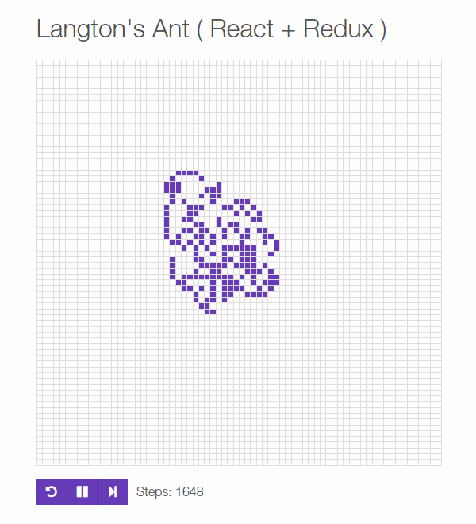

# Langton's ant

Langton's ant is a two-dimensional universal Turing machine with a very simple set of rules.

Read more details about Langton's ant on the [Wikipedia Page](https://en.wikipedia.org/wiki/Langton's_ant).



[Try this demo on your browser](https://nzbin.github.io/langton-ant-redux/)

> Recommended opening on Chrome.

## Running the code

Checkout this repo and

```
$ npm install
$ npm start
```

The demo will be running at http://localhost:8080/

## Building

To build the code, run:

```
$ npm run build
```
